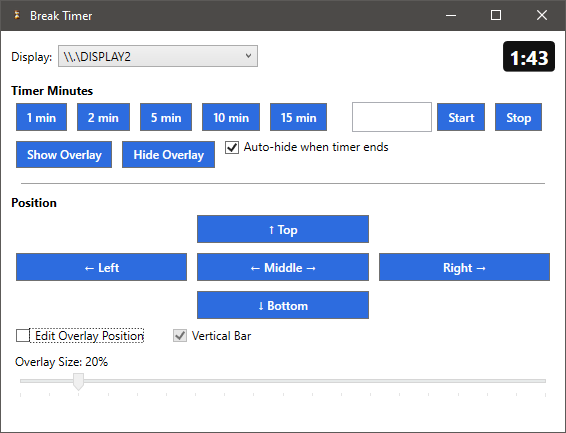

# EventTimerOverlay

A small utility to show a countdown timer with progress bar on a second screen.  Useful to show the time remaining for breaks during a long meeting or the time limit for small group discussion while slides are still on the screen.

The main control window allows you to select which monitor where the timer will be shown.  There are presets for common breaks, but you can enter your own custom duration and start and stop as neeeded.

If you need to temporarily hide the timer, you can hide or show the overlay with the provided buttons.  You can also choose to automatically hide the timer 5 seconds after it reaches 0:00.

The progress bar can be automatically positioned along the top, bottom, left, right, or center of the screen, or enable Edit mode to position and resize as needed.

The progress bar can be shown horizontally or vertically.

